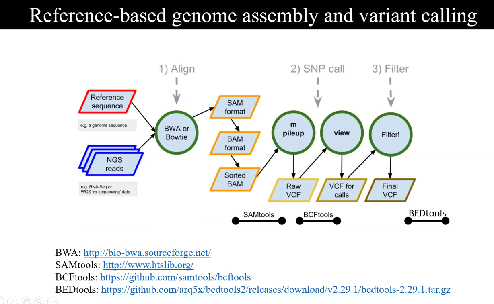

# sequence databases and file formats
## FASTQ file format
- contains quality with sequence
- contains four lines information
  1. `line 1` - identifier line contain unique identifier for the sequence , also contain some additional info.
       example:-
      * `EAS***` - unique instrument name
      * `136` - the run id
      * `FC70***` - flowcell id
      * `2` - flowcell lane
      * `2104` - no within the flowcell lane
      * `15343` - X coordinate
      * `197393` - Y coordinate
      * `1` - paired-end or mate-pair reads onlytext
      * `Y` - Y when read is filtered (bad quality reads), else N (good quality reads)
      * `18` - even no , 0 when non of the control bits are on
      * `ATCGCC` - index sequence
  2. `line 2` - actual sequence
  3. `line 3` - separator line generally mimics the line 1
  4. `line 4` - phred scores of each bases of sequence given in the line2

## FASTQC tools
- java based tools to generate the QC reports
- primer and adaptor to be removed using `trimmomatic`
- check quality control on raw sequence from high throughput pipelines
- after quality check if data has any problems then it goes to trimmomatic
- data might have 2 types of problems
  *  quality - we cut the sequence and take only the  part of the sequence for good quality
  *  techinal sequence or adaptors - during library preparation we add adaptors for reads to be run on the flowcell we use some adaptors to bind it with flowcell ( because flowcell has complementery seq)
- FASTQC check the primers and adaptors details
- then using trimmomatic we cut it out

## Reference based genome assembly and variant calling


1. **align** - `BWA` or `bowtie`  align `Reference sequence` to  `NGS reads` and gives a SAM format file (sequence alignment map).
```bash
bwa mem reference.fasta reads.fastq > output.sam
```
2. **conversion** -  .then this `SAM` format is converted into `BAM` for computer understandable language. 
```bash
samtools view -S -b output.sam > output.bam
```
3. **sorting** - BAM file is sorted into `sorted BAM` by rearranging the reads according to the reference genome.
```bash
samtools sort output.bam -o sorted.bam
```
4. **indexing** -
5. **summarize** - usign `mpileup` commmand of the sam tools for base call (assingment identity) at each position , pileup data creates `RAW .bcf` file 
6.**view** - view from the bcftools convert the .bcf into .vcf file , listing all the variants(SNPs) .hence we get the VCF ( a tab seperated file - tell position of chromosome where is the SNP present )
7. **filtering**- filtering low-quality or non-significant variants using BEDtools provides Final VCF file

## GFF/GTF format
> a plain text file format used to describe gene and other features of the DNA, RNA , protein seq in tab separated line format
> each line has 9 columns
  * `seqname`- name of the chromosome or scaffold
      * Example: chr1, scaffold_23, NC_000001.11
  * `source`- name of the program that generated this feature or data source
      * Example: Ensembl, Augustus, GeneMark, maker
  * `feature/type`- feature type e.g, gene, variation , similarity
      * Example: gene, mRNA, exon, CDS, tRNA, repeat_region
  * `start`- start position of the feature
      * Example: 1050
  * `end`- end position of the feature
      * Example: 1250
  * `score`- a floating point value
      * Example: 0.98, 23.5, or . if not applicable
  * `strand`- forward (+ve) and rever (-ve) 
  * `frame/phase`-  Phase tells how many bases were leftover from the previous CDS (coding seq) that still need to be completed in next CDS to make a full codon (3 bases).

| Phase | Meaning                                                                       |
| ----- | ----------------------------------------------------------------------------- |
| `0`   | No leftover → start codon cleanly here                                        |
| `1`   | 2 bases leftover from previous CDS → take 1 base from current CDS to complete |
| `2`   | 1 base leftover → take 2 bases from current CDS to complete                   |


  * `atrribute`- It stores extra information about each feature (gene, CDS, exon, etc.). in key value form like gene id ,transcrpit id, name etc.
      * ID=cds00001;Parent=transcript00001;gene_name=ABC1
### motifs
> short conserved region in the protein
### domains
> large fucntional unit of protein
### profiles
> is the details of the protein tells
              - conserved region
              - varible region
              - frequency of occurence of particular AA
  

## need of studting protein domains
> to classify the unknown protein on the basis of experimentally charachterised protein
> automated methods to annotate protein families , domain , functional sites
> predictive diagnostic models - using the info of charachterised protein to uncharaterised proteins

## describing seq in protein family 
* as a motif rule
  - describes essential features of the protein
  - catalytic residues , important structural residues
* as a profile
  - describes variablity in family arrangement
  
## prosite
> a database of functional and structural motifs and domains
> motifs describes as regular expression

## steps to do
### open the [uniprot](https://www.uniprot.org/) and search the protein
1. look for the  `features`
2. check the `binding sites` and `position` of the domain
3. 
